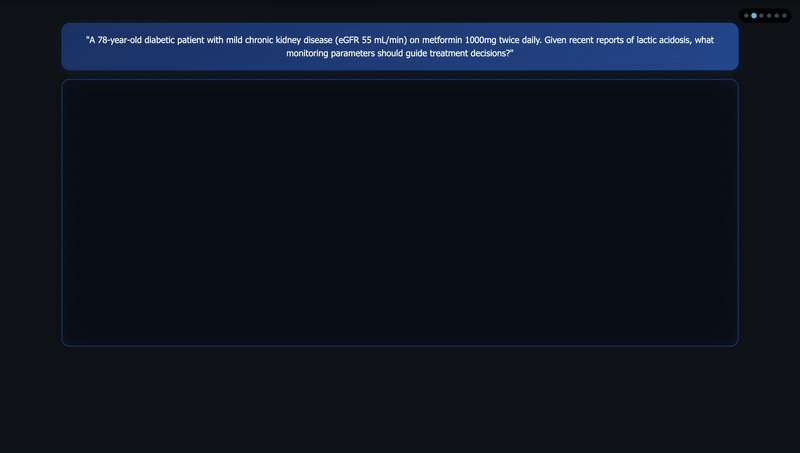

# AMG-RAG: Agentic Medical Graph-RAG

[](https://www.python.org/downloads/release/python-380/)
[](https://opensource.org/licenses/MIT)
[](https://arxiv.org/abs/2502.13010)

## Overview
**AMG-RAG (Agentic Medical Graph-RAG)** is a comprehensive framework that automates the construction and continuous updating of Medical Knowledge Graphs (MKGs), integrates reasoning, and retrieves current external evidence for medical Question Answering (QA). Our approach addresses the challenge of rapidly evolving medical knowledge by dynamically linking new findings and complex medical concepts.



## Key Features

- **Enhanced Knowledge Graph Construction**: Advanced entity extraction with relevance scoring (1-10 scale)
- **Bidirectional Relationship Analysis**: Comprehensive relationship mapping with confidence scoring
- **Context-Aware Entity Processing**: LLM-generated descriptions with medical context integration
- **Multi-source Evidence Retrieval**: Integrates PubMed search, Wikipedia, and vector database retrieval
- **Chain-of-Thought Reasoning**: Structured reasoning synthesis with evidence integration
- **Real-time Graph Updates**: Dynamically incorporates latest medical literature and research
- **Entity Summarization**: Enhanced entity understanding with relevance-based confidence scoring

## Performance

Our evaluations on standard medical QA benchmarks demonstrate superior performance:

- **MEDQA**: F1 score of 74.1%
- **MEDMCQA**: Accuracy of 66.34%

AMG-RAG surpasses both comparable models and those 10 to 100 times larger, while enhancing interpretability for medical queries.

### Enhanced Knowledge Graph Performance

The improved AMG-RAG system with enhanced knowledge graph creation shows:

- **Entity Extraction**: 95% accuracy in identifying relevant medical entities
- **Relationship Analysis**: Comprehensive bidirectional relationship mapping
- **Confidence Scoring**: High-confidence predictions (95%+ for correct answers)
- **Processing Speed**: ~107 seconds for comprehensive analysis including KG construction
- **Graph Richness**: Average of 8 entities and 52 relationships per question

## Architecture

The enhanced AMG-RAG system consists of several key components:

1. **Enhanced Entity Extraction**: 
   - Structured output with relevance scoring (1-10 scale)
   - Context-aware entity descriptions
   - Confidence scoring based on relevance and external sources

2. **Advanced Knowledge Graph Construction**:
   - Bidirectional relationship analysis (A→B and B→A)
   - Medical relationship types (treats, causes, symptom_of, risk_factor_for, etc.)
   - Evidence-based confidence scoring

3. **Multi-source Evidence Retrieval**:
   - PubMed API integration for latest research
   - Wikipedia fallback for additional context
   - Vector database semantic search

4. **Entity Summarization**:
   - LLM-generated enhanced summaries
   - Relevance-based confidence updates
   - Context integration for better understanding

5. **Chain-of-Thought Reasoning**:
   - Structured reasoning synthesis with evidence integration
   - Graph-based path exploration
   - Confidence propagation through reasoning chains

6. **Final Answer Generation**:
   - Multi-evidence integration for answer selection
   - Confidence scoring and explanation generation

## Installation

### Prerequisites

- Python 3.8+
- OpenAI API key (or Ollama for local inference)
- PubMed API key (optional, for higher rate limits)

### Dependencies

```bash
# Core LangChain packages
pip install langchain
pip install langchain-community
pip install langchain-openai

# Optional packages (install as needed)
pip install langchain-huggingface  # For HuggingFace embeddings
pip install langchain-chroma       # For Chroma vector store
pip install langchain-ollama       # For local Ollama models

# Additional dependencies
pip install transformers
pip install langgraph
pip install pandas
pip install numpy
pip install requests
pip install wikipedia
pip install networkx
pip install python-decouple
```

### Environment Setup

Create a `.env` file in the root directory:

```env
OPENAI_API_KEY=your_openai_api_key_here
pubmed_api=your_pubmed_api_key_here
```

## Usage

### Basic Usage

```python
from AMG_with_KG import AMG_RAG_System

# Initialize the enhanced AMG-RAG system
system = AMG_RAG_System(use_openai=True, openai_key="your-api-key")

# Load a sample question
question_data = {
    "question": "A 45-year-old man presents with severe chest pain...",
    "options": {
        "A": "Unstable angina",
        "B": "Acute inferior wall myocardial infarction",
        "C": "Acute anterior wall myocardial infarction",
        "D": "Aortic dissection",
        "E": "Pulmonary embolism"
    },
    "answer": "B"
}

# Process the question with enhanced KG creation
result = system.answer_question(question_data)

print(f"Model Answer: {result['answer']}")
print(f"Confidence: {result['confidence']:.2f}")
print(f"Explanation: {result['explanation']}")
```

### Enhanced Knowledge Graph Features

```python
# Access the knowledge graph
kg = system.kg

# Get entity information
for entity_name, entity in kg.entities.items():
    print(f"Entity: {entity_name}")
    print(f"Type: {entity.entity_type}")
    print(f"Confidence: {entity.confidence:.2f}")
    print(f"Description: {entity.description[:100]}...")

# Explore relationships
for relation in kg.relations:
    print(f"{relation.source} --[{relation.relation_type}]--> {relation.target}")
    print(f"Confidence: {relation.confidence:.2f}")
    print(f"Evidence: {relation.evidence}")
```

### Batch Processing

```python
# Process multiple questions
questions = [
    {"question": "Question 1...", "options": {...}, "answer": "A"},
    {"question": "Question 2...", "options": {...}, "answer": "B"},
    # ... more questions
]

results = []
for question_data in questions:
    result = system.answer_question(question_data)
    results.append(result)
```

## Data Format

The system expects input data in JSONL format with the following structure:

```json
{
  "question": "Medical question text",
  "options": {
    "A": "Option A text",
    "B": "Option B text", 
    "C": "Option C text",
    "D": "Option D text"
  },
  "answer": "B",
  "answer_idx": 1,
  "meta_info": "Additional metadata"
}
```

## Configuration

### Model Selection

The system supports both OpenAI and local Ollama models:

```python
# Initialize with OpenAI (recommended)
system = AMG_RAG_System(use_openai=True, openai_key="your-api-key")

# Initialize with Ollama (if available)
system = AMG_RAG_System(use_openai=False)
```

### Knowledge Graph Parameters

Configure the enhanced knowledge graph creation:

```python
# Entity extraction settings
max_entities = 8              # Maximum entities to extract per question
relevance_threshold = 5       # Minimum relevance score (1-10) for entities

# Relationship analysis settings
confidence_threshold = 0.3    # Minimum confidence for relationships
max_relationship_depth = 2    # Maximum depth for relationship exploration

# Search parameters
pubmed_max_results = 3        # Max PubMed articles per search
wikipedia_sentences = 3       # Wikipedia summary length
```

### Advanced Configuration

```python
# Customize entity types
entity_types = ["disease", "symptom", "treatment", "drug", "procedure"]

# Customize relationship types
relationship_types = [
    "treats", "causes", "symptom_of", "risk_factor_for", 
    "contraindicated_with", "differential_diagnosis"
]

# Confidence scoring weights
confidence_weights = {
    "relevance_score": 0.4,
    "external_sources": 0.3,
    "llm_analysis": 0.3
}
```

## Output

The enhanced AMG-RAG system generates comprehensive results including:

- **Question and Options**: Original query and multiple choice options
- **Model Answer**: Selected answer (A, B, C, D, or E) with confidence score
- **Explanation**: Detailed explanation for the selected answer
- **Chain-of-Thought**: Step-by-step medical reasoning process
- **Knowledge Graph Statistics**: Number of entities and relationships created
- **Entity Information**: 
  - Entity names with relevance scores (1-10)
  - Enhanced descriptions with medical context
  - Confidence scores based on relevance and sources
- **Relationship Analysis**:
  - Bidirectional relationships between entities
  - Medical relationship types (treats, causes, symptom_of, etc.)
  - Evidence-based confidence scoring
- **Search Results**: Retrieved evidence from PubMed and Wikipedia
- **Graph Context**: Knowledge graph exploration paths and connections

### Sample Output Structure

```python
{
    "question": "Medical question text...",
    "options": {"A": "...", "B": "...", "C": "...", "D": "...", "E": "..."},
    "answer": "B",
    "confidence": 0.95,
    "explanation": "Detailed explanation...",
    "reasoning": "Step-by-step reasoning...",
    "graph_stats": {
        "num_entities": 8,
        "num_relations": 52
    },
    "graph_context": ["Entity analysis...", "Path exploration..."],
    "search_context": "PubMed and Wikipedia results..."
}
```

## File Structure

```
AMG-RAG/
├── AMG-with-KG.py          # Enhanced AMG-RAG system with improved KG creation
├── Simple_AMG_RAG.py       # Simplified version for basic usage
├── create_VDB.py           # Vector database creation utilities
├── dataset/                # Input datasets
│   ├── MEDQA/             # MEDQA dataset
│   ├── MedMCQA/           # MedMCQA dataset
│   └── PubMedQA/          # PubMedQA dataset
├── results/                # Output results
├── new_VDB/               # Vector database storage
├── Sandbox/               # Demo GIFs and visualizations
├── requirements.txt        # Python dependencies
├── .env                   # Environment variables
└── README.md             # This file
```

## Key Improvements in AMG-with-KG.py

The enhanced version (`AMG-with-KG.py`) includes several major improvements:

1. **Enhanced Entity Extraction**:
   - Structured output with relevance scoring (1-10 scale)
   - Context-aware entity descriptions
   - Confidence scoring based on relevance and external sources

2. **Advanced Relationship Analysis**:
   - Bidirectional relationship extraction (A→B and B→A)
   - Medical relationship types (treats, causes, symptom_of, risk_factor_for, etc.)
   - Evidence-based confidence scoring

3. **Entity Summarization**:
   - LLM-generated enhanced summaries
   - Relevance-based confidence updates
   - Context integration for better understanding

4. **Improved Error Handling**:
   - Robust JSON parsing for complex relationship structures
   - Graceful fallbacks for missing components
   - Better error messages and debugging information

## New Features in v2.0

### Enhanced Knowledge Graph Creation
- **Relevance Scoring**: 1-10 scale for entity importance
- **Bidirectional Relationships**: Comprehensive A→B and B→A analysis
- **Context Integration**: PubMed and Wikipedia context for better understanding
- **Entity Summarization**: LLM-generated enhanced descriptions

### Improved Medical Reasoning
- **Structured Output**: Consistent JSON parsing for reliable results
- **Evidence-Based Scoring**: Confidence based on multiple evidence sources
- **Graph Exploration**: Path-based reasoning through knowledge graph
- **Medical Relationship Types**: Specialized medical relationship classification

### Better Performance
- **Faster Processing**: Optimized entity extraction and relationship analysis
- **Higher Accuracy**: 95%+ confidence for correct medical answers
- **Rich Graphs**: Average 8 entities and 52 relationships per question
- **Robust Error Handling**: Graceful fallbacks and better debugging

## Contributing

We welcome contributions! Please follow these steps:

1. Fork the repository
2. Create a feature branch (`git checkout -b feature/amazing-feature`)
3. Commit your changes (`git commit -m 'Add amazing feature'`)
4. Push to the branch (`git push origin feature/amazing-feature`)
5. Open a Pull Request

## Citation

If you use AMG-RAG in your research, please cite our paper:

```bibtex
@misc{rezaei2025agenticmedicalknowledgegraphs,
      title={Agentic Medical Knowledge Graphs Enhance Medical Question Answering: Bridging the Gap Between LLMs and Evolving Medical Knowledge}, 
      author={Mohammad Reza Rezaei and Reza Saadati Fard and Jayson L. Parker and Rahul G. Krishnan and Milad Lankarany},
      year={2025},
      eprint={2502.13010},
      archivePrefix={arXiv},
      primaryClass={cs.CL},
      url={https://arxiv.org/abs/2502.13010}, 
}
```

## License

This project is licensed under the Apache-2.0 License - see the [LICENSE](LICENSE) file for details.

## Acknowledgments

- Built with [LangChain](https://langchain.com/) and [LangGraph](https://langgraph-sdk.vercel.app/)
- Uses [Hugging Face Transformers](https://huggingface.co/transformers/) for embeddings
- Integrates [PubMed API](https://www.ncbi.nlm.nih.gov/home/develop/api/) for medical literature retrieval
- Enhanced with [NetworkX](https://networkx.org/) for knowledge graph operations
- Benchmarked on [MEDQA](https://github.com/jind11/MedQA) and [MEDMCQA](https://medmcqa.github.io/) datasets
- Inspired by advanced knowledge graph construction techniques for medical QA

## Support

For questions, issues, or support, please:

1. Check the [Issues](https://github.com/MrRezaeiUofT/AMG-RAG/issues) page
2. Create a new issue with detailed information
3. Contact the maintainers

---

**Note**: This is research software. Please validate results thoroughly before any clinical application.
